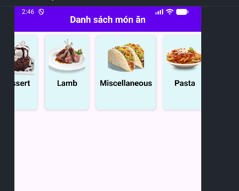

Introduction

Ứng dụng gửi yêu cầu HTTP tới API (ví dụ: GET /categories).
Server xử lý và trả về dữ liệu JSON (danh sách món ăn, hình ảnh, mô tả...).
Ứng dụng phân tích dữ liệu JSON và hiển thị lên giao diện người dùng.

Demo

</img>
</img>

 Ứng dụng Android lấy dữ liệu từ API và hiển thị danh sách món ăn.
